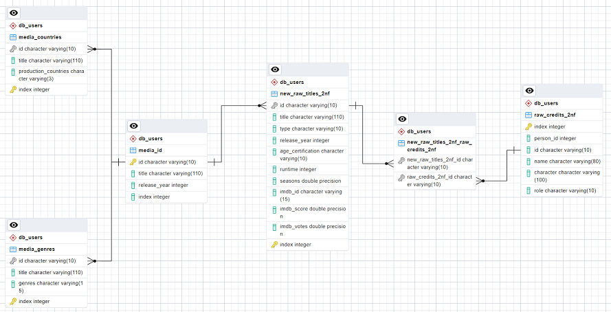

# DE Capstone Project 1

## Table of contents

<!-- TOC -->
* [DE Capstone Project 1](#de-capstone-project-1)

  * [About](#about)
  * [Tech Stack Used](#tech-stack-used)
  * [Project Deliveries Plan](#project-deliveries-plan)
  * [How To Use The Program](#how-to-use-the-program)
  * [Input Dataset Cleaning](#input-dataset-cleaning)
  * [Changes in Tables in a Database](#changes-in-tables-in-a-database)
  * [Entity Relationship Diagram (ERD)](#entity-relationship-diagram-erd)
  * [Possible Future Improvements](#possible-future-improvements)
<!-- TOC -->

## About

This project is an exercise in translating business requirements into data engineering tasks. For this project the initial data is a dataset consisting of **[Netflix TV Shows and Movies](https://www.kaggle.com/datasets/thedevastator/the-ultimate-netflix-tv-shows-and-movies-dataset?select=Best+Shows+Netflix.csv)** of 2022 from **kaggle.com**. The data needs to be transformed and made available for other stakeholders to use. The datasets can be loaded to a PostgreSQL database using Python code or pgAdmin. The code also allows for some manipulation of the database using CLI commands.

The program also has a simple recommender function to offer user a recommendation of a movie or a tv show based on a genre.

**Note:** to run the program properly, install dependencies from `poetry.lock` file by running the `poetry install` in the terminal window (requires `poetry` to be installed first). 

## Tech Stack Used

* Programing language - **Python**;
* Servers and load balancing - for this project, data is stored locally on the machine;
* Data storage and querying - **PostgreSQL**;
* For interactive data cleaning - **Jupyter Notebook**;
* Data cleaning and normalization - **Pandas**;
* Package and dependency management - **Poetry**

## Project Deliveries Plan

* **Database**:
  * For a database I chose PostgreSQL as it offers more features than some other databases (i.e. MySQL), it is free, easy-to-implement database management system and is better suited for enterprise-level applications. As this project assumes I am a part of an experimental Netflix team, a database suited for enterprise is a logical choice.
  * For testing purposes, I created `db_analyst` and `db_scientist` users and gave them appropriate grants to use `db_users` schema and tables in it.
  * `/misc` folder contains SQL code used to create users, schema and add tables to schema, create relationships between tables.
####
* **Data normalization**:
  * To normalize data I use **Jupyter Notebook** with **Pandas** module. The `data_cleaning.py` file contains functions used to inspect, clean and normalize datasets. 
####
* **Database usage**:
  * The database can be manipulated by using Python code. The code allows for ad hoc functionality (`test`, `create`, `copy`, `check`) to quickly create new tables, populate them with data, check the existing tables in the database. For table creation and data copying I use `.txt` files from `/misc` folder.
  * The program also allows the user to write their own SQL code and pass it to the database to read and write data (read and write privileges depend on the user connected to the database).
####
* **Tables**:
  * Only two tables - `new_raw_titles_2nf` and `raw_credits_2nf` are stored in the database as all other tables are just derived from these two tables, so data duplication in this case is not necessary, as to save space on the database (useful when the database is cloud-based as you usually pay for the storage of a database). These tables are placed under `public` schema that can only be accessed by a 'db_admin' user.
  * Any other helper tables are derived from these tables. All tables that can be accessed by `db_analyst` and `db_scientist` users are placed under `db_users` schema.
####
* **Output data**:
  * Normalized tables are stored in `Source/data/output/` folder. While it may not be the best way to store data, I chose to do this so that if the primary data in a database gets corrupted or lost, the data could be recreated faster.

## How To Use The Program

To use the program, run the _`main.py`_ file. You will then be greeted with a welcome message. The program uses some pre-set functions for simple ad hoc operations within the database. It also allows for custom SQL queries to be written (proper usage and specific SQL functionality must comply with SQL and PostgreSQL).

To interact with the program use the built-in commands:
*     To test a connection with a database: test
*     To create a table: create
*     To get the list of tables in a database: check
*     To copy data from a CSV file to a specified table: copy
*     To write a custom SQL statement: sql
*     To get a movie or a tv show recommendation based on a genre: rec
*     To quit the program: exit

To see the commands at any time, pass an empty of wrong keyword and then type _**help**_ in the terminal window.

**Note:** 
- To restart the program, run _`main.py`_ again.

### **Important:**

To connect to the database, the `Source/db_config/config.py` file needs to read these values from `credentials.ini` file:

| Variable | Your value    |
|----------|---------------|
| database | database_name |
| host     | host_name     |
| user     | user_name     |
| password | user_password |
| port     | port          |

Store the `credentials.ini` file in `Source/credentials/` folder to connect to the database with no issues.

## Input Dataset Cleaning

Because no data is perfect, data cleaning and normalization was performed while keeping the context of data.

Following the cleaning procedure some columns were changed:

| File        | Column                       | Change                                                                                                                                             |
|-------------|------------------------------|----------------------------------------------------------------------------------------------------------------------------------------------------|
| raw_credits | character                    | Exploded values of multiple characters that some actors have played in some of their movies. Made a new row containing a single 'character' value. |
|             | index                        | Recreated 'index' column after .explode() function to give unique 'index' values that a dataset had before.                                        |
| raw_titles  | genres, production_countries | Changed the list-like values to proper list values. Used .explode() function to normalize the dataset.                                             |
|             | index                        | Recreated 'index' column after .explode() function to give unique 'index' values that a dataset had before.                                        |
|             | genres                       | Changed a value of 'documentation' to 'documentary' in 'genres' column as 'documentation' is not a valid genre.                                    |

Duplicate rows where all row values matched with previous row values were dropped before cleaning and during normalization.

Columns that contain empty values in Pandas show up as _**float**_ or _**string**_ data type. That is how Pandas treats empty values. NaN stands for **Not A Number** and is one of the common ways to represent the missing value in the data. It is a special **[floating-point](https://pandas.pydata.org/docs/user_guide/missing_data.html#integer-dtypes-and-missing-data)** value and cannot be converted to any other type than float.

## Changes in Tables in a Database

To create relationships between tables, I created a separate `media_id` table that takes `id`, `title` and `release_year` columns from `raw_titles_2nf` table. This way I was able to isolate `id` column of every movie and tv show. I used `id` column to create relationships between tables, so now a user can create new tables or views by joining different tables on a common `id` column, whereas at first there was no apparent connection between different tables. 

## Entity Relationship Diagram (ERD)

## Possible Future Improvements

1. Web-based API (base on REST API or FastAPI);
2. Actual recommender engine;
3. unittest tests for the code;
4. Save log files.